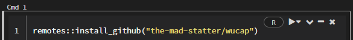
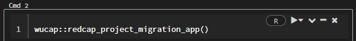
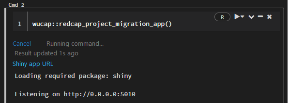
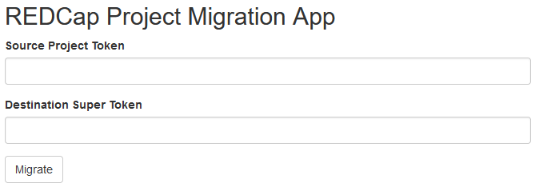
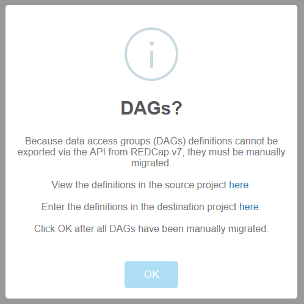

```{r, include = FALSE}
knitr::opts_chunk$set(
  echo = FALSE,
  message = FALSE, 
  warning = FALSE, 
  collapse = TRUE,
  comment = "#>"
)
```

```{r, eval=FALSE}
rmarkdown::render(
  "redcap_project_migration_app.Rmd",
  output_format = "all"
)
```


```{r setup}
library(wucap)
```

# Background

[Washington University in Saint Louis](https://wustl.edu/) (WUSTL) maintains a legacy [REDCap](https://www.project-redcap.org/) instance frozen at v7.3.5 due to undocumented modification of the codebase to support home-grown features. Migration of active projects from legacy to current production and archival of inactive projects are desirable due to failing hardware.

Upgrading REDCap in place is best practice but was never possible due to the codebase modifications. The next best approach is export and import of a [CDISC](https://www.cdisc.org/) Operational Data Model (ODM) extensible markup language (XML) file, but this fails for some projects because current production is unable to import large XML files.

Therefore, we are reduced to migrating projects in parts either using the web or application programming interface (API). The web interface approach is tedious (especially when file uploads are present), and using the API is our best option.

The `redcap_project_migration_app` [{shiny}](https://shiny.rstudio.com/) app was written to help automate as much of the migration process as possible using the API in an easy to use form.

# Where to Run

While the app could be run from any R installation, it is perhaps best to run it on the WUSTL [Databricks](https://databricks.com/) platform given that:

1. everyone who needs to use the app should have or can have access to Databricks
2. Databricks removes the requirement of having R installed locally
3. traffic will be contained within the WUSTL network

# Package Installation

The [{wucap}](https://github.com/the-mad-statter/wucap) package was written and hosted on Github to make distribution and use of the code as convenient as possible.

Before running the app code, the package must be installed. To install the package run the following command in a Databricks workbook R cell:

```
remotes::install_github("the-mad-statter/wucap")
```

Which looks like this:



The above command installs the package to ephemeral storage along with its dependencies. Persistent storage options are being investigated to prevent the need to install the package every time a cluster is started. Wait for installation to complete before trying to run the app.

# Usage Instructions

## 1 Start App

To use the app run the following command in a Databricks workbook R cell:

```
wucap::redcap_project_migration_app()
```

Which looks like:



This command will produce a clickable link to open the app in a new tab:



Clicking on the link will open a new tab containing the app:



## 2. Enter Tokens and Start Migration

The app requires:

1. A project-level (i.e., regular) API token for the given user with full export rights from the source project.
2. A super-user API token from the REDCap destination instance.

The app will utilize api calls on the user's behalf to create a new project on the destination REDCap instance and copy over the following information:

1. Project attributes such as title, purpose, and if the project is longitudinal
2. Data dictionary including field names, labels, and types as well as branching logic
3. Arms, named events, and repeated events

## 3. Data Access Group Definitions

Some projects make use of data access groups (DAGs). Unfortunately, such definitions are not exportable from REDCap v7. Therefore, if they exist in the source project, they must be manually keyed into the destination project. The app will suspend with a dialog box before migrating the actual project data asking the user to supply DAG definitions.



The dialog box will give a link to the DAG definition page in the source project and a link to the DAG definition page in the destination project. Each DAG name in the source project must be entered into the destination project.

Once all DAGs have been defined click the OK button. If no DAGs need be defined, just click OK.

The app will then migrate the data in batches from source to destination and also migrate both file uploads and signatures individually.
